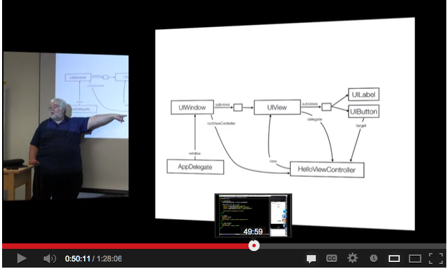
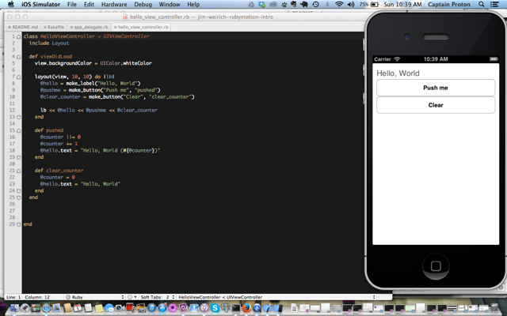

jim-weirich-rubymotion-intro
============================

Inspired by Jim Weirich talk, this simple RubyMotion iPhone app demonstrates how to use basic Ruby principles like 
"layout managers, smart libraries, and DSL's" without employing XCode's Interface Builder. If you have any question or ideas 
about RubyMotion, feel free to shoot me a Tweet, [@captproton](https://twitter.com/captproton).

About Jim's Talk
---
Jim Weirich ([github repo](https://github.com/jimweirich)), the original author Rake for Ruby, gave a talk about writing iOS apps
with Ruby at the [CincyCocoaDev meetup back in April 2013](http://www.meetup.com/CincyCocoaDev/events/112048512/).  He approaches 
it as an experienced Rubyist learning how use Ruby to program for the iPhone with the help of the 
[OS Programming: The Big Nerd Ranch Guide](http://www.bignerdranch.com/book/ios_programming_the_big_nerd_ranch_guide_rd_edition_).  

Lucky for us, the video of the talk was pushed up to YouTube:

[April CincyCocoaDev - RubyMotion with Jim Weirich - on YouTube](http://youtu.be/z7E1zx9j31M)

About the App
---
The app in the repo is one of several Jim presented.  Also, note that this app does fork a little bit from what he presented.  For example, I moved layout.rb from /app to /app/lib and told
Rakefile to load all files in the lib folder before the files in the app directory.  I read somewhere that files in app are
loaded in alphabetical order.  Also, unlike the structure of a Ruby on Rails app, the lib is inside the app folder, and that 
might throw off Rails fans a tiny bit.

Screenshot of the app:

